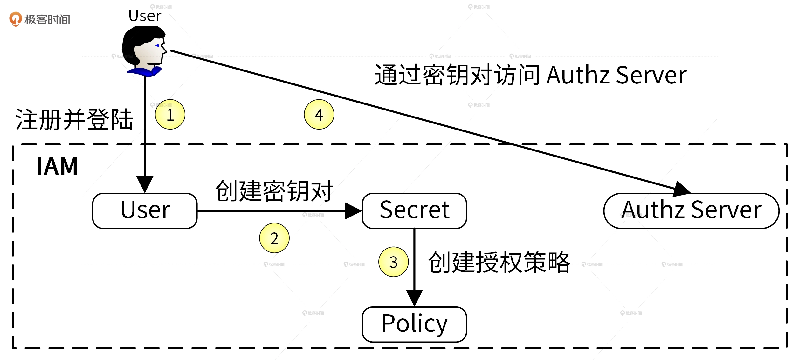
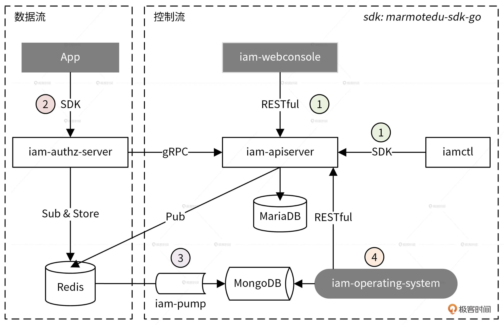

# 环境搭建

此章节目的是了解项目的主要预期以及如何搭建 GoLang 的开发环境

## 项目预期

Go 应用的安全包括 2 方面：

1. 认证(authn)：禁止非法用户访问服务，通过 JWT 实现
2. 资源授权(authz)：禁止非法访问不属于该用户的服务内资源

问题：特定的条件下，如何判断谁能够 / 不能够对哪些资源做哪些操作

项目预期：编写一个 Web 服务，用于给第三方用户提供访问控制服务。

## 项目内在逻辑梳理

### 功能所需资源



1. 用户注册并登录到 IAM 系统，以用户名和密码作为唯一的身份标识来访问 IAM 系统，完成认证。
2. 因为访问 IAM 的资源授权接口是通过密钥的方式进行认证，所以用户需要在 IAM 中创建属于自己的密钥资源。
3. 因为 IAM 通过授权策略完成授权，所以用户需要在 IAM 中创建授权策略。
4. 请求 IAM 提供的授权接口，IAM 根据用户请求内容和授权策略来决定一个授权请求是否被允许

```
涉及到的系统资源
- 密钥：对密钥的增删改查
- 用户：对用户的增删改查及批量操作
- 策略：对授权策略的增删改查及批量操作
```

### IAM 的系统架构



五大组件

- iam-api-server：通过 Restful api 完成三大资源的增删改查
- iam-authz-server：授权服务，从 iam-api-server 获取密钥和授权策略并缓存到内存中，用户通过请求`/v1/authz`接口完成资源授权并同时将授权日志上传到 redis
  > 用户请求上述接口查询缓存的授权策略，根据这些策略来决定授权是否通过
- iam-pump：从 redis 获取缓存的授权日志，分析后存入 mongodb
- xxx-sdk-go：iam 系统的 SDK,封装了 `iam-api-server` 和 `iam-authz-server` 的所有 api 接口，方便用户调用
- iam-ctl：iam 系统的客户端，通过`xxx-sdk-go`访问`iam-api-server` 和 `iam-authz-server`组件，封装了`iam-api-server`组件的接口及其它功能，用户可以通过命令行的方式访问`iam-api-server`

三大数据库

- redis：缓存密钥和授权策略，降低访问延时；缓存授权日志作为运营系统的数据来源
- mysql：持久存储用户/密钥/授权策略
- mongodb：存储授权日志，供运行系统展示和分析

### 流程梳理

1.  创建平台资源

    用户在客户端通过 api 或者 sdk 请求`iam-api-server`组件的接口完成三种资源的增删改查，最后这个组件将资源持久化存储在 mysql 中

2.  请求 API 完成资源授权
    用户请求`/v1/authz`接口，通过密钥认证后该接口会查询授权策略，确定资源请求是否可以通过。

    `iam-authz-server`会将密钥和策略信息缓存在内存实现快速查询，来提升接口性能。

> 缓存实现原理:<br/>1.`iam-authz-server`调用`iam-api-server`提供的 gRPC 接口，将信息缓存到内存中<br/>2.为了保证缓存和`iam-api-server`信息一致，后者会在信息更新时往特定的 redis channel（iam-authz-server 也会订阅）中发送`PolicyChanged` 和 `SecretChanged`, `iam-authz-server`监听到新消息就会获取并解析，根据内容判断是否重新调用 gRPC 接口获取最新信息并更新到内存。

3. 授权日志数据分析

   `iam-authz-server` 上传授权日志到 Redis 高速缓存，然后 `iam-pump` 组件对其进行异步消费，再把清理后的数据保存在 MongoDB 中，供运营系统 `iam-operating-system` 查询

   > 注意：iam-authz-server 将授权日志保存在 Redis，可以最大化减少写入延时;不保存在内存中是因为授权日志量无法预测，当授权日志量很大时，很可能会将内存耗尽，造成服务中断。

4. 运营平台授权数据展示
   `iam-operating-system` 是 IAM 的运营系统，通过查询 MongoDB 获取并展示运营数据，比如 A 用户的授权 / 失败次数、授权失败时的授权信息等

## 常见软件架构模式

1. 前后端分离架构:项目功能较多，规模较大

2. MVC 架构：项目功能较少，规模较小

## 搭建开发环境

### Linux 服务器配置

1. 添加 going 用户
2. 给 going 用户添加 sudo 权限
3. 修改 yum 源
4. 使用 going 用户登录服务器
5. 创建 $HOME/workspace 文件夹作为开发的工作目录
6. 配置 $HOME/.bashrc 文件

```bash
# User specific aliases and functions
alias rm='rm -i'
alias cp='cp -i'
alias mv='mv -i'
# Source global definitions
if [ -f /etc/bashrc ]; then
        . /etc/bashrc
fi
# User specific environment
# Basic envs
export LANG="en_US.UTF-8" # 设置系统语言为 en_US.UTF-8，避免终端出现中文乱码
export PS1='[\u@dev \W]\$ ' # 默认的 PS1 设置会展示全部的路径，为了防止过长，这里只展示："用户名@dev 最后的目录名"
export WORKSPACE="$HOME/workspace" # 设置工作目录
export PATH=$HOME/bin:$PATH # 将 $HOME/bin 目录加入到 PATH 变量中

# Default entry folder
cd $WORKSPACE # 登录系统，默认进入 workspace 目录
```

### 依赖安装和配置

1. 安装所需工具的依赖

```bash
sudo yum -y install make autoconf automake cmake perl-CPAN libcurl-devel libtool gcc gcc-c++ glibc-headers zlib-devel git-lfs telnet lrzsz jq expat-devel openssl-devel
```

2. 安装 git

```bash
cd /tmp
wget --no-check-certificate https://mirrors.edge.kernel.org/pub/software/scm/git/git-2.36.1.tar.gz
tar -xzvf git-2.36.1.tar.gz
cd git-2.36.1/
./configure
make
sudo make install
git --version          # 输出 git 版本号，说明安装成功
```

3. 配置 git

```bash
git config --global user.name "joey yan"
git config --global user.email "yueyueyan1215@163.com"
git config --global credential.helper store    # 设置 Git，保存用户名和密码
git config --global core.longpaths true # 解决 Git 中 'Filename too long' 的错误
git config --global core.quotepath off # 关闭Git 输出中的路径名转义
git lfs install --skip-repo # 开启git lfs，但不在当前仓库启用，能够克隆大于 100M 的文件
```

### Go 编译环境安装和配置

1. 下载 go 源码包并安装

```bash
wget -P /tmp/ https://golang.google.cn/dl/go1.23.2.linux-amd64.tar.gz
# 解压安装
mkdir -p $HOME/go
tar -xvzf /tmp/go1.23.2.linux-amd64.tar.gz -C $HOME/go
mv $HOME/go/go $HOME/go/go1.23.2
```

2. 设置环境变量

```bash
# Go envs
export GOVERSION=go1.23.2
export GO_INSTALL_DIR=$HOME/go # Go 安装目录
export GOROOT=$GO_INSTALL_DIR/$GOVERSION # GOROOT 设置
export GOPATH=$WORKSPACE/golang # GOPATH 设置
export PATH=$GOROOT/bin:$GOPATH/bin:$PATH # 将 Go 语言自带的和通过 go install 安装的二进制文件加入到 PATH 路径中
export GO111MODULE="on" # 开启 Go moudles 特性
export GOPROXY=https://goproxy.cn,direct # 安装 Go 模块时，代理服务器设置
export GOPRIVATE=
export GOSUMDB=off # 关闭校验 Go 依赖包的哈希值
```


3. 初始化工作区

```bash
mkdir -p $GOPATH
cd $GOPATH
go work init
go env GOWORK # 执行此命令，查看 go.work 工作区文件路径
```

4. ProtoBuf 编译环境安装

```bash
# 第一步：安装 protobuf
cd /tmp/
git clone -b v3.21.1 --depth=1 https://github.com/protocolbuffers/protobuf
cd protobuf
./autogen.sh
./configure
make
sudo make install
protoc --version # 查看 protoc 版本，成功输出版本号，说明安装成功
# libprotoc 3.21.1

# 第二步：安装 protoc-gen-go
go install github.com/golang/protobuf/protoc-gen-go@v1.5.2
```

### Go 开发 IDE 安装和配置

goLand 或者 vscode，远程连接到服务器
