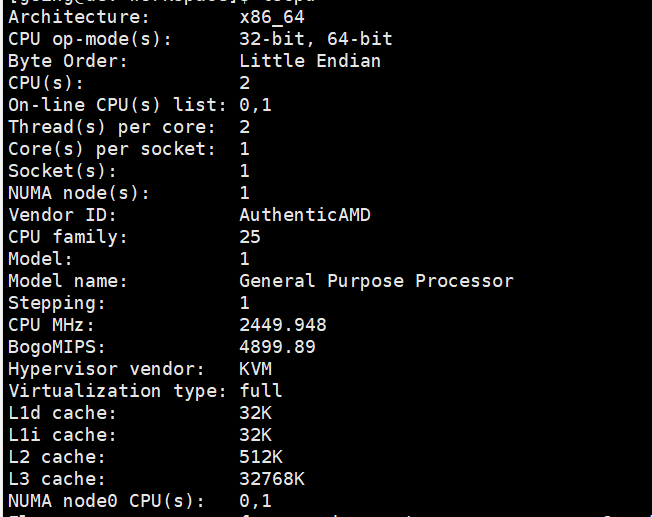

# 常用命令

## 查看 Linux 的所有用户信息

命令：`cat /etc/passwd`

结果展示

> username:password:UID:GID:user-info:home-dir:shell<br/>
> 用户名:密码占位符:UID:GID:用户描述:用户主目录:登录 Shell

UID 为 0 表示当前用户为管理员.具有最高权限

## 添加用户和用户组

```
useradd going # 创建 going 用户
passwd going # 设置密码
sed -i '/^root.*ALL=(ALL).*ALL/a\going\tALL=(ALL) \tALL' /etc/sudoers  # 添加sudo权限
```

添加 sudo 详解：

1. `-i`表示直接在源文件上修改
2. `/^root.*ALL=(ALL).*ALL/'`匹配以 root 开头并且包含 ALL=(ALL) 和 ALL 字段的行
3. `a\going\tALL=(ALL) \tALL`在匹配到的行后添加新行，`\t`为 tab 字符用于对齐，`ALL=(ALL) ALL`表示该用户可以用 sudo 执行所有命令，权限和 root 类似

## 修改 yum 源

```
mv /etc/yum.repos.d /etc/yum.repos.d.bak # 先备份原有的 Yum 源
mkdir /etc/yum.repos.d
wget -O /etc/yum.repos.d/CentOS-Base.repo https://mirrors.aliyun.com/repo/Centos-vault-8.5.2111.repo
yum clean all && yum makecache  # 清理原来的yum并重新创建缓存
```

## 别名

作用：用于为常用的命令创建简短替代名称的功能
命令：`alias cp='cp -i'`

## 查看 Linux 架构信息

查看系统的核心信息：uname -a/-m

> Linux hcss-ecs-f13a 4.18.0-348.7.1.el8_5.x86_64 #1 SMP Wed Dec 22 13:25:12 UTC 2021 x86_64 x86_64 x86_64 GNU/Linux

单项查看：lscpu


## TODO
