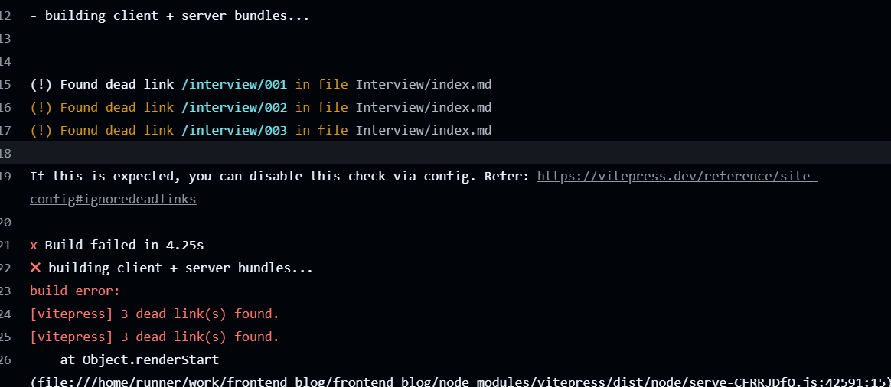
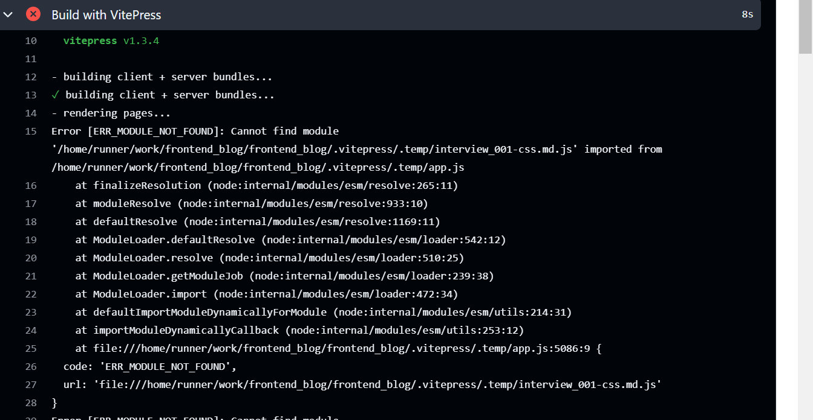

# vitepress 发布到 github 上报错

报错：

很容易发现是 build 阶段报错，且是因为死链接

接下来去查看 `docs/interview` 文件夹,突然发现这个文件夹名称是 Interview,试着改了成了小写，在本地执行 build 命令成功了，但推送到 github 上以后 build 又爆了一样的错，看上去似乎是 vscode 没有识别出文件夹名称的大小写变更。

但是 vscode 本地能 build 成功说明应该不是 vscode 的问题吧，现在剩下的唯一可能跟这个有关系的就是 git 了，上网搜了一下，果然如此：

`git config core.ignorecase`，如果返回为 false 则代表区分大小写， 为 true 则不区分大小写。

本地运行一下这个命令，果然输出了 true,执行`git config core.ignorecase false`,vscode 的 git 插件里立刻识别出了大小写

push 上去以后发现代码里同时出现了 Interview 和 interview 文件夹，且构建依旧失败

