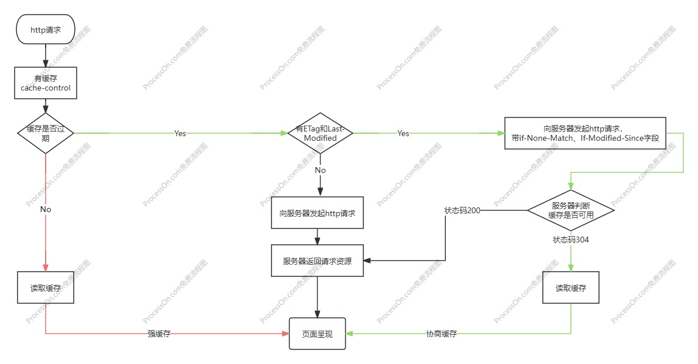
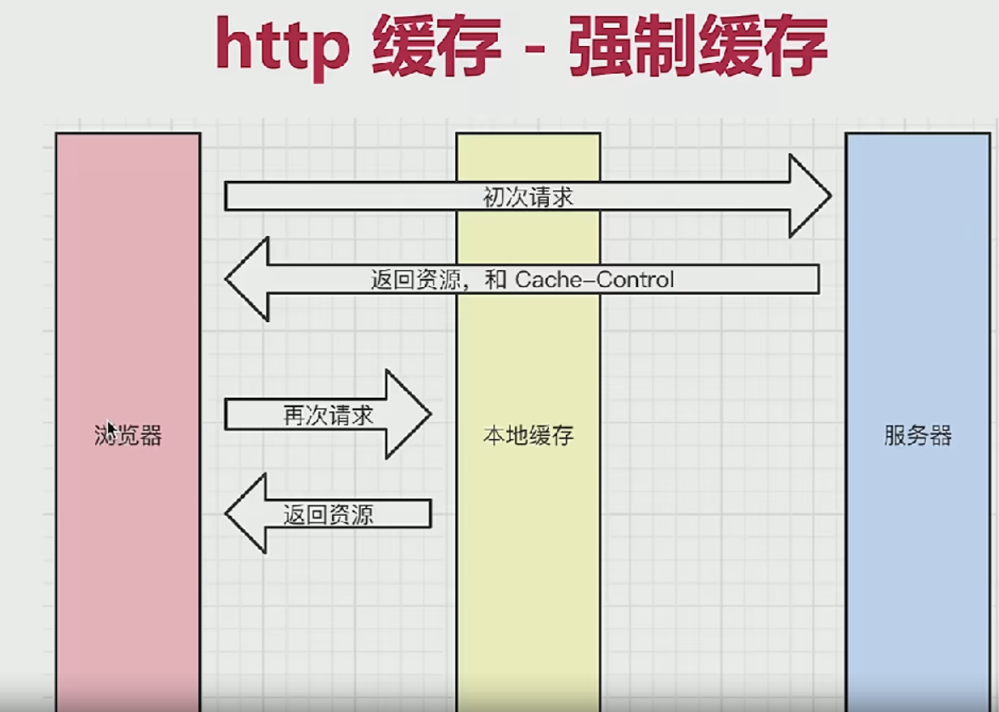
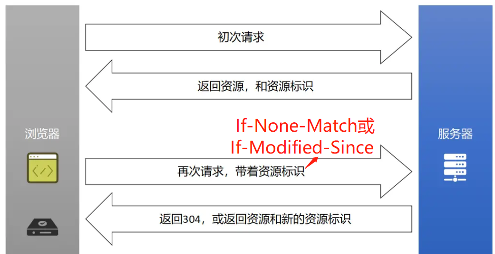

# http 基础知识

## http 状态码

### 状态码分类

- 1xx:服务器收到请求
- 2xx:请求成功
- 3xx:重定向
- 4xx:客户端错误
- 5xx:服务端错误

### 常见状态码

- 200:成功
- 301:永久重定向（配合响应头 location 新地址，浏览器自动处理）,比如网站迁移
  > 1. 会缓存重定向结果，下次直接跳新地址，不再访问旧地址（除非用户清理缓存）
  > 2. 地址栏显示新地址。
- 302/307:临时重定向（配合响应头 location 新地址，浏览器自动处理），302 适用于登录跳转、短期维护，307 适用于表单提交、api 请求重定向
  > 1. 不会缓存。每次访问旧地址时，浏览器都重新请求服务器确认去哪里
  > 2. 地址栏显示新地址
- 304:资源未被修改，即服务端表明该资源已请求过，客户端应使用缓存资源
- 404:资源不存在
- 403:没有权限
- 500:服务器错误
- 504:网关超时，服务器作为网关或代理时，没在规定时间等到上游服务器响应

::: tip 302 vs 307

1. 302 是旧版标准，允许浏览器用 GET 代替 POST（不安全）。
2. 307 是新版标准，强制保持原请求方法（POST 还是 POST，不会偷偷换成 GET）

:::

## http 请求方法

### 传统 http 请求方法

- get:获取服务器的数据
- post:向服务器提交数据

### 最新 http 请求方法

- get:获取数据
- post:新建数据
- patch/put:更新数据
- delete:删除数据

## Restful api

一种 API 设计方法

- 传统 API 设计：把每个 url 当作一个功能
- Restful API 设计：把每个 url 当作一个唯一的资源

### url->资源

1. 尽量不用 url 参数
   > 传统 api 设计：/api/list?page=2 
   > Restful api 设计：/api/list/2
2. 用 method 表示操作类型，以更新资源为例
   > 传统 api 设计：post 请求 /api/update-blog?id=100 
   > Restful api 设计：patch 请求 /api/list/100

## http headers

除了浏览器规定的 header 以外，还可以设置自定义 header

### 请求头

- Accept:浏览器可接受的数据格式
- Accept-Encoding:浏览器可接受的压缩算法，比如 gzip
- Accept-Language:浏览器可接受语言，比如 zh-CN
- Connection:一次 TCP 连接重复使用，值为 keep-alive
- cookie
- Host:域名
- User-Agent(UA):浏览器信息
- Content-Type:发送数据的格式，比如 application/json

### 响应头

- Content-Type:返回数据的格式
- Content-Length:返回数据的大小，多少字节
- Content-Encoding:返回数据的压缩方法
- Set-Cookie:服务端修改 cookie

### http 缓存相关的 header

- Cache-Control:
- Expires:
- Last-Modified:
- If-Modified-Since:
- ETag:
- If-None-Match:

## http 缓存

### 什么是缓存

定义：第一次访问某网站，服务端会把资源返回到客户端并告知浏览器是否可以缓存这些资源；再次访问，浏览器会先检查本地缓存，若未过期则直接从缓存中读取，而不需要向服务器请求

存在原因：让页面加载更快

> 1. 减少延迟:避免每次都远程获取**静态资源**，减少页面加载时间
> 2. 节省带宽:避免重复请求，减少不必要的网络流量
> 3. 优化用户体验

资源区分：

- 可缓存资源：静态资源 js、css、img，一旦上线以后就不会被修改
- 不可缓存资源：html、网页业务数据

### http 缓存策略

#### 强制缓存

200(from memory cache),200(from disk cache)都属于强制缓存，判断依据是有 Cache-Control 且没有过期

#### 协商缓存(对比缓存)

##### Cache-Control:

归属于响应头,可以设置过期时间；

示例：`max-age=2592000, public, must-revalidate, proxy-revalidate`

- max-age:秒级别的过期时间
- no-cache:不强制缓存，交给服务端判断
- no-store:不强制，让服务端重新返回资源,不常用
- private:只允许最终用户，比如手机等，做缓存，不常用
- public:允许中间路由等做缓存

> Expires 归属于响应头,可以设置过期时间,已被 Cache-Control 代替

相关字段归属于响应头，表示资源标识

##### 其他

1. Last-Modified:资源的最后修改时间
2. ETag:资源的唯一标识，用字符串表示

> 两者共存，优先使用 etag，Last-Modified 只能精确到秒级，若资源被重复生成，而内容不变，则 etag 更准确

### 刷新操作方式，对缓存的影响

#### 3 种刷新操作

1. 正常操作：地址栏输入 url，跳转连接，前进后退
2. 手动刷新：F5，点击浏览器的刷新按钮，右击菜单刷新
3. 强制刷新：ctrl+F5，强制清除缓存并从服务器请求最新的资源

| 方式     | 强制缓存 | 协商缓存 |
| -------- | -------- | -------- |
| 正常操作 | 有效     | 有效     |
| 手动刷新 | 有效     | 有效     |
| 强制刷新 | 失效     | 失效     |
