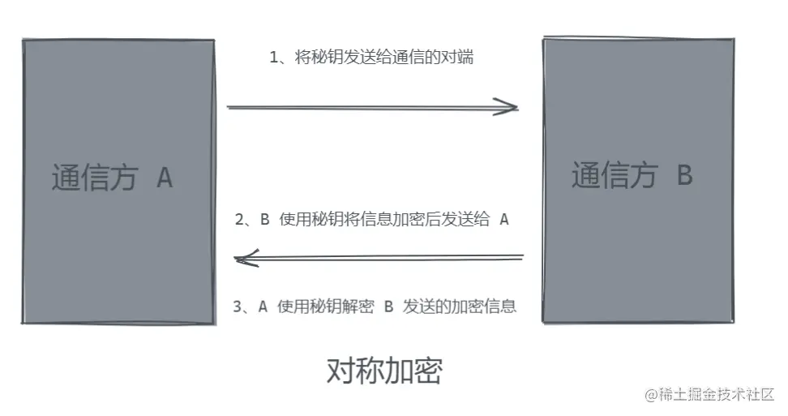
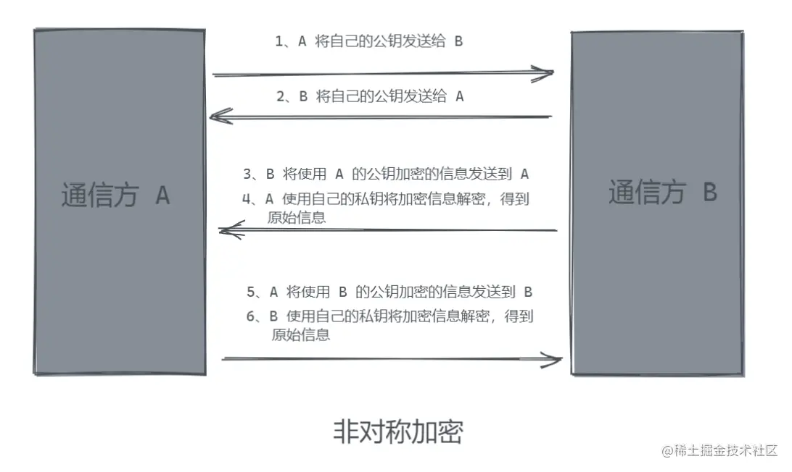
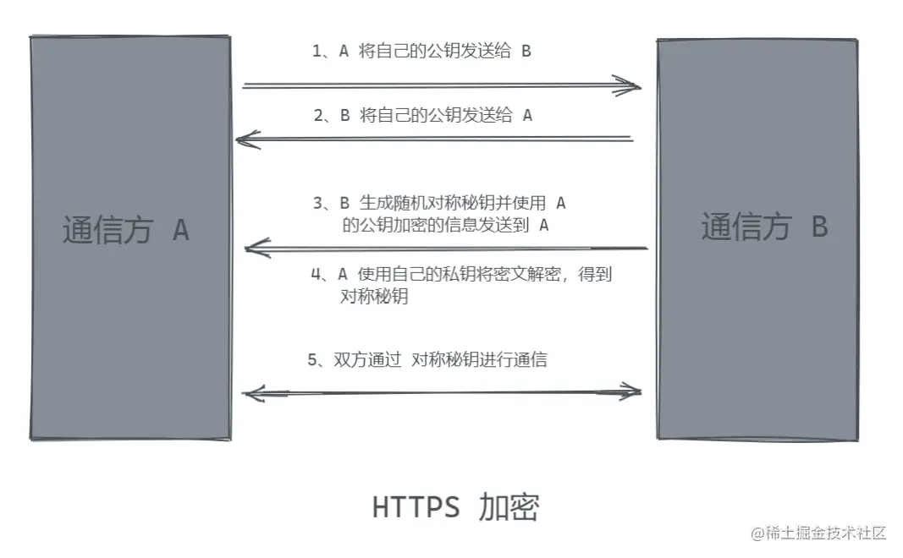
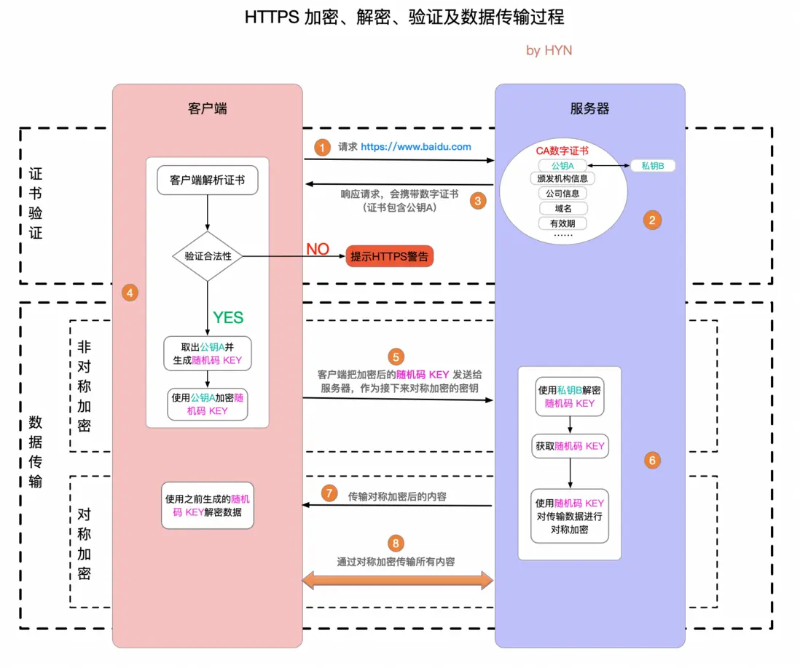

# https 基础知识

## 和 http 区别

1. http 是明文传输，敏感信息容易中途被劫持
2. https 是 **http+加密传输**,劫持成功也无法解密
3. 现代浏览器逐渐开始强制使用 https 协议

## https 加密方式

使用下面 2 种方式方式组合假面

### 对称加密

使用同一个 key 进行加密和解密

风险：可以先劫持 key 再劫持信息

### 非对称加密

使用一对 key，A 加密之后，只能用 B 来解密

安全性：即使劫持了 public key 和信息，无私钥也无法解密

### https 加密

综合了上述 2 种加密方式

1. 先采用非对称加密方式获取 public key
2. 再采用对称加密进行后续通信

原因：

1. 使用安全的非对称方式方式加密 public key
2. 越简单的东西成本越低，对称加密成本低；后续通信数据量大，所以选择成本更低的对称加密

## https 证书

作用：网站备案，防止中间人攻击，中间人用自己的 public key 替换通信另一方的 public key，所以需要使用正规的第三方证书

浏览器会自动校验证书

