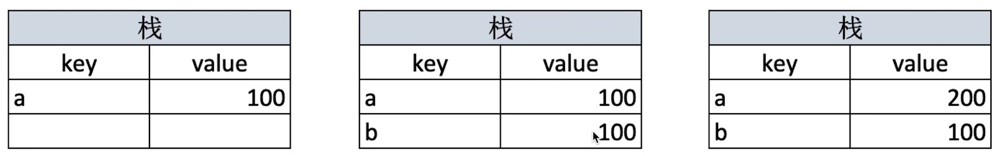
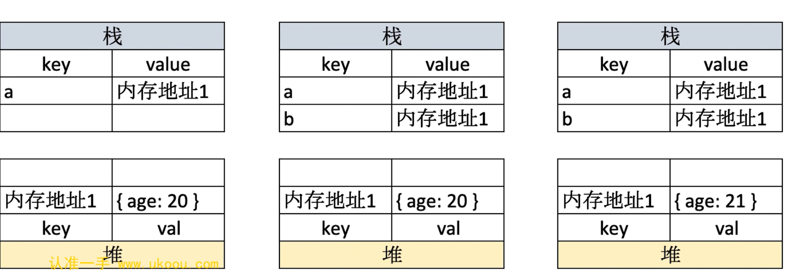
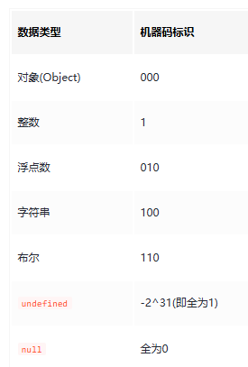

# 变量类型和计算

## 变量类型

### 值类型 vs 引用类型

- 值类型：包括：`number/string/boolean/Symbol/Bigint/undefined/null`。
  - 值类型的变量直接存储数据，保存在栈内存
  - 赋值时，值类型的变量会复制值的副本。每个变量独立，互不影响。
    
- 引用类型：包括：`array/object/function`。
  - 引用类型的变量存储的是指向数据的引用（指针），数据通常存储在堆内存，栈内存中存储的是内存地址
  - 赋值时，复制的是引用而非数据，因此多个变量指向同一个对象，修改其中一个变量的值会影响其他变量。
    

### typeof 运算符

作用：

1. 识别原始类型（除 null 以外）、函数类型，并返回类型名称
2. 识别引用类型和 null 为 `object`

原理：javaScript 的类型值通过二进制表示

::: warning 注意
特例：`typeof null === 'object'`，但实际上 null 是值类型，原因是判断数据类型时，是根据机器码低位标识来判断，而 null 的机器码标识号为全 0,最终被误判为 object。这属于 js 自身 bug
:::

### 深拷贝 vs 浅拷贝 vs 赋值

区别：

- 赋值：让两个变量指向同一个内存地址。不会创建新的对象，修改会相互影响
- 浅拷贝：创建一个新对象，复制第一层属性，修改第一层属性不会影响原对象，但嵌套对象的修改会互相影响
- 深拷贝：创建一个新对象，递归复制所有属性。每一层的数据都独立，修改新对象不会影响原对象

|        | 和原数据是否指向同一对象 | 原数据为基本数据类型         | 原数据包含子对象             |
| ------ | ------------------------ | ---------------------------- | ---------------------------- |
| 赋值   | 是                       | 改变【会】使原数据一同改变   | 改变【会】使原数据一同改变   |
| 浅拷贝 | 否                       | 改变【不会】使原数据一同改变 | 改变【会】使原数据一同改变   |
| 深拷贝 | 否                       | 改变【不会】使原数据一同改变 | 改变【不会】使原数据一同改变 |

#### 浅拷贝实现：

- Object.assign({},obj1)
- Array.prototype.concat()
- Array.prototype.slice()
- ...obj 展开运算符

#### 深拷贝实现：

- JSON.parse(JSON.stringify(obj1)):会忽略 undefined 和 symbol,不支持循环引用对象的拷贝

#### 手写实现

::: code-group

```js [浅拷贝]
function isObject(obj) {
  return typeof obj === "object" && obj !== null;
}
function shallowClone(obj) {
  if (!isObject(obj)) {
    return obj;
  }
  let dst;
  if (obj instanceof Array) {
    dst = [];
  } else {
    dst = {};
  }
  for (let prop in obj) {
    /**不使用obj.hasOwnProperty(prop)的原因：
     如果 obj 对象有自定义的 hasOwnProperty 方法（覆盖了原生方法），这段代码可能会失败
     **/
    if (Object.prototype.hasOwnProperty.call(obj, prop)) {
      dst[prop] = obj[prop];
    }
  }
  return dst;
}
```

```js [深拷贝]
/**
 * deepClone中的map参数用于解决循环引用
 */
function isObject(obj) {
  return typeof obj === "object" && obj !== null;
}
function deepClone(obj, map = new Map()) {
  if (!isObject(obj)) {
    return obj;
  }
  if (map.has(obj)) {
    return map.get(obj); //将当前对象存入 map，避免循环引用
  }
  let dst = obj instanceof Array ? [] : {};
  map.set(obj, dst);
  for (let prop in obj) {
    if (Object.prototype.hasOwnProperty.call(obj, prop)) {
      if (isObject(obj[prop])) {
        dst[prop] = deepClone(obj[prop], map);
      } else {
        dst[prop] = obj[prop];
      }
    }
  }
  return dst;
}
```

```js [解决深拷贝的爆栈问题]
/**
 * 在 JavaScript 中，递归调用会占用栈空间，每一个递归函数调用都需要占用一个栈帧。
 * 如果递归的层数过多，超出了 JavaScript 引擎栈的大小，就会报错。
 * 改用迭代方式（非递归）： 使用循环和显式的栈来替代递归，可以避免栈溢出。
 * 例如，使用队列或者栈来处理对象的遍历。
 **/
function createData(deep, breadth) {
  const data = {};
  let temp = data;
  for (let i = 0; i < deep; i++) {
    temp = temp["data"] = {};
    for (let j = 0; j < breadth; j++) {
      temp[j] = j;
    }
  }
}
//
const data1 = createData(1, 3); // 1 层深度，每层有 3 个数据 { data: { '0': 0, '1': 1, '2': 2 } }
const data2 = createData(3, 0); //3层深度，每层有 0 个数据 { data: { data: { data: {} } } }
const data3 = createData(1000); //1000层深度，无压力 { data: { data: { data: [Object] } }
const data4 = createData(10, 100000); //10层深度，100000 层广度，较慢，数据遍历需要时间
const data5 = createData(10000); //10000层深度，deepClone(data5)Maximum call stack size exceeded
function isObject(obj) {
  return typeof obj === "object" && obj !== null;
}
function deepClone(obj) {
  //栈存储待拷贝的对象及其对应的目标对象
  let stack = [{ src: obj, dst: {} }];
  //存储已经拷贝的对象的映射，解决循环引用
  let map = new Map();
  //循环遍历栈
  while (stack.length > 0) {
    //不断弹出栈中的元素进行处理，直到栈为空
    let { src, dst } = stack.pop();
    if (map.has(src)) {
      //直接从 map 中取出已经拷贝好的目标对象 dst，然后继续处理下一个元素
      dst = map.get(src);
      continue;
    }
    //将 src 和 dst 这对映射关系存储到 map 中。后续遇到 src 时，可以直接返回已经拷贝的目标对象
    map.set(src, dst);
    //遍历源对象的属性
    for (let prop in src) {
      if (Object.prototype.hasOwnProperty.call(src, prop)) {
        if (isObject(src[prop])) {
          let newDst = Array.isArray(src[prop]) ? [] : {};
          dst[prop] = newDst;
          stack.push({ src: src[prop], dst: newDst });
        } else {
          dst[prop] = src[prop];
        }
      }
    }
  }
}
```

:::

## 变量计算-类型转换

::: tip
truly 变量：!!a====true

falsely 变量：!!a===false，包括 0/NaN/空字符串/null/undefined/false
:::

- 字符串拼接：字符串拼接任何类型，最终都会转换为字符串
- if 语句：会判断条件是否为 falsely 变量
- 逻辑判断：`&&`/`||`/`！`
- `==`运算符:会做隐式类型转换，所以除了`obj.a==null`以外，其他一律用`===`

```js
"1" == 1; // true
0 == false; // true
0 == null; // false
0 == undefined; // false
0 == !!null; // true
0 == !!undefined; // true
null == undefined; // true

const number1 = new Number(3);
const number2 = new Number(3);
number1 == 3; // true
number1 == number2; // false
```
