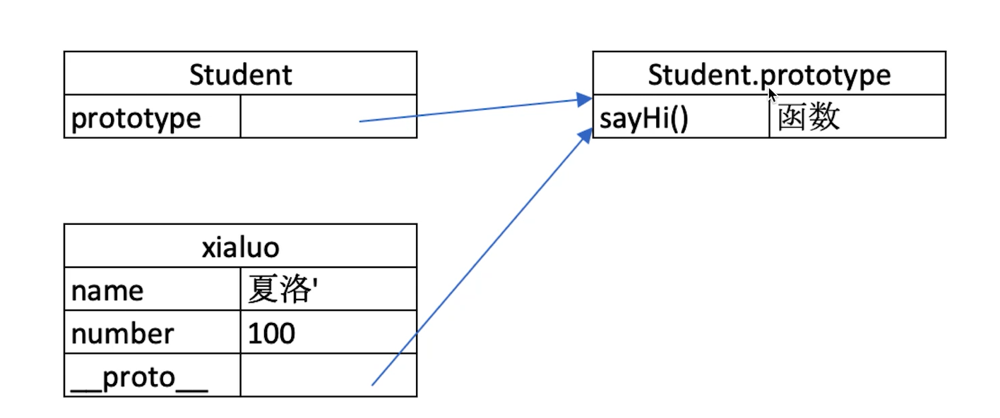
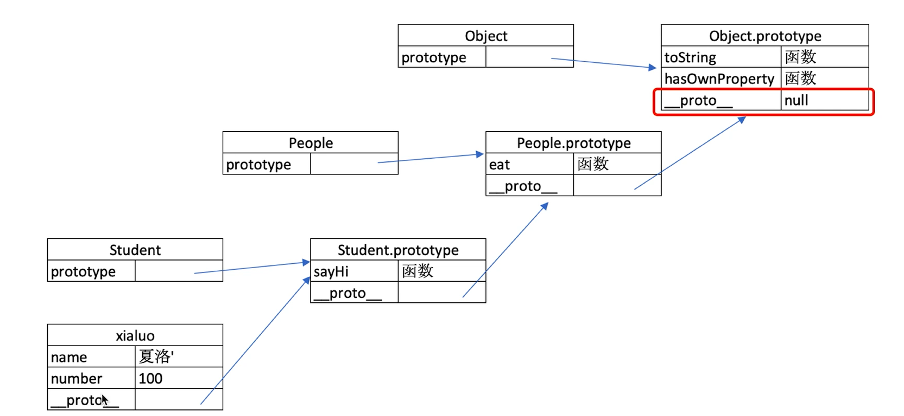

# 原型和原型链

> 继承是指将特性从父代传递给子代，以便新代码可以重用并基于现有代码的特性进行构建。JavaScript 使用**对象**实现继承。每个对象都有一条链接到另一个称作原型的对象的内部链。该原型对象有自己的原型，依此类推，直到原型是 null 的对象。根据定义，null 没有原型，并作为这条原型链中最后的一环

> JavaScript 对象有一条指向原型对象的链。当试图访问对象的属性时，不仅在该对象上查找属性，还会在该对象的原型上查找属性，以及原型的原型，依此类推，直到找到一个名字匹配的属性或到达原型链的末尾。

## class 和继承

class 的本质：原型链继承机制的语法糖

```js
class People {
  //私有字段：只能在类方法中被引用，而不能直接通过实例访问
  #ssn;
  // 公共字段：可以直接通过实例访问，主要用于设置默认值
  address = "Unknown Address";
  constructor(name, age, ssn, address) {
    this.name = name;
    this.age = age;
    this.#ssn = ssn;
    // 设置公共字段
    if (address) {
      // 如果传入了 address 参数，使用传入的值
      this.address = address;
    }
  }
  //实例方法
  introduce() {
    console.log(`Hi, my name is ${this.name} and I am ${this.age} years old.`);
  }
  //getter字段
  get ssn() {
    return this.#ssn;
  }
  //setter字段
  set ssn(newSsn) {
    if (typeof newSsn === "string" && newSsn.length === 11) {
      this.#ssn = newSsn;
    } else {
      console.log("Invalid SSN format");
    }
  }
  get address() {
    return this._address; // 访问内部的 _address 属性
  }
  set address(newAddress) {
    if (newAddress && typeof newAddress === "string") {
      this._address = newAddress; // 将新的值存储在 _address 内部字段
    } else {
      console.log("Invalid address");
    }
  }
  // 静态字段，只能通过类访问
  static className = "People";
  // 静态方法
  static describeClass() {
    console.log(`This class is called ${this.className}.`);
  }
  // 静态 getter
  static get classInfo() {
    return `Class Name: ${this.className}`;
  }

  // 静态 setter
  static set classInfo(info) {
    const className = info.split(":")[1]?.trim();
    if (className) {
      this.className = className;
    }
  }
}
class Parent extends People {
  constructor(name, age, ssn, job) {
    // 调用父类 People 的构造函数
    super(name, age, ssn);
    this.job = job;
  }
}
const person = new People("Alice", 30, "123-45-6789", "123 Main St");
const parent = new Parent("Alice", 30, "123-45-6789", "123 Main St", "worker");
const person2 = new People("Alice", 30, "123-45-6789");
// 使用 setter 设置私有字段 ssn
person.ssn = "987-65-4321"; // 设置一个有效的 SSN
// 通过 getter 获取私有字段 ssn
console.log(person.ssn); // 输出: 987-65-4321
console.log(person.address); //输出：123 Main St
console.log(person2.address); //输出：Unknown Address
```

## 原型和原型链

上面的`typeof People`的结果为`function`

### 显式原型(constructor.prototype)

定义：每个构造函数都有一个 prototype 属性，其指向一个对象，该对象是由构造函数创建的所有实例的共享原型。

作用：在上面定义方法和属性，使得这些方法和属性可以被所有实例共享

```js
function Person(name) {
  this.name = name;
}
Person.prototype.sayHello = function () {
  console.log(`Hello, my name is ${this.name}`);
};
const person1 = new Person("Alice");
person1.sayHello(); // 输出: Hello, my name is Alice
```

### 隐式原型(`__proto__`)

定义：每个对象实例都有一个 `__proto__` 属性，它指向该对象的构造函数的 prototype 对象。

作用：让实例对象可以访问到构造函数原型对象上定义的属性和方法

```js
function Person(name) {
  this.name = name;
}
Person.prototype.sayHello = function () {
  console.log(`Hello, my name is ${this.name}`);
};
const person1 = new Person("Alice");
// 通过隐式原型访问 Person.prototype 上的方法
person1.__proto__.sayHello.call(person1); // Hello, my name is Alice
console.log(person1.__proto__ === Person.prototype); // true
```



### 基于原型的执行规则

原型链是 js 实现对象继承的机制。


1. 先在对象 obj 的自身属性和方法找
2. 找不到则去对象 obj 的`__proto__`中查找，逐级向上查找（即 person1.`__proto__`，它指向 Person.prototype））
3. 在 Object.prototype 上找到了对应的属性和方法，于是就执行了该方法。

层级关系：

1. person1 对象：它没有 sayHello 方法，但它有一个 `__proto__`，指向 Person.prototype。
2. Person.prototype 对象：它有 sayHello 方法，并且是所有 Person 类实例共享的原型。
3. Object.prototype 对象：这是所有 JavaScript 对象的最终原型，所有对象最终都继承自它。它的 `__proto__` 属性为 null，表示原型链的终点。

### 常用 api

- 获取实例的隐式原型:`Object.getPrototypeOf(obj)`，返回对象 obj 的原型链（即 `obj.__proto__`）,用来查看某个对象的隐式原型是哪个。
- 设置实例的隐式原型：`Object.setPrototypeOf(obj, prototype)`,相当于修改了 obj.`__proto__`，即改变了对象的隐式原型,不推荐。

```js
function Animal(name) {
  this.name = name;
}
const dog = new Animal("Dog");
const human = {
  greet() {
    console.log("Hello!");
  },
};
// 获取 dog 对象的隐式原型
Object.getPrototypeOf(dog) === Animal.prototype; //true
// 修改 dog 对象的隐式原型
Object.setPrototypeOf(dog, human);
dog.greet(); //Hello!
Object.getPrototypeOf(dog) === Animal.prototype; //false
```

## 类型判断 instanceof

作用：用于检测构造函数的 prototype 属性是否出现在某个实例对象的原型链上。

语法：`object instanceof constructor`
