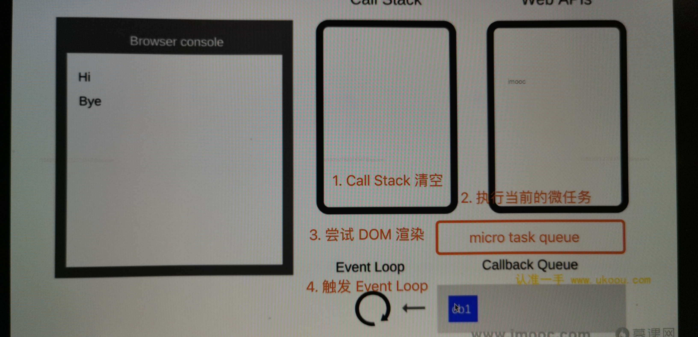

# 异步 2


- 栈：函数调用形成了一个由若干帧堆叠而成的栈。
- 堆：对象被分配在堆中，堆是一个用来表示一大块（通常是非结构化的）内存区域的计算机术语
- 队列：JS 运行时包含一个待处理消息的消息队列,每一个消息都关联着一个用以处理这个消息的回调函数。

## Promise

三种状态：pending、fullfilled、rejected

```js
const p3 = Promise.reject("my error").catch((err) => {
  console.log(err);
});
console.log(p3, "p3"); // fulfilled状态的Promise
//不触发
p3.catch((res) => {
  console.log(res, "res");
});

const p4 = Promise.reject("my error").catch((err) => {
  throw new Error("new error");
});
console.log(p4, "p4"); //rejected状态的Promise
//触发
p4.catch((res) => {
  console.log(res, "res");
});
```

::: danger 注意
then 和 catch 正常情况下都是返回的 fullfilled 状态，不会触发后续的 catch；有抛出报错的情况下都是返回的 rejected 状态，会触发 catch
:::

### 手写 Promise

功能点：

1. 初始化&异步调用
2. then/catch 链式调用
3. 实现基本的 API,如`.resolve`/`reject`/`.race`/`.all`

::: code-group

```js [用法示例]
const p = MyPromise((resolve, reject) => {
  // resolve("同步");
  setTimeout(() => {
    resolve("异步");
  });
});
const p1 = p.then((data) => {
  return data + 1;
});
const p2 = p1.then((data) => {
  return data + 2;
});
const p3 = p2.catch((err) => {
  console.error(err);
});
const p4 = MyPromise.resolve();
const p5 = MyPromise.reject("new error");
const p6 = MyPromise.all([p1, p2]);
const p7 = MyPromise.race([p1, p2]);
```

```js [代码实现]
class MyPromise {
	state = 'pending' //pending、fullfilled、rejected
	value = undefined reason = undefined resolveCallBacks = [] //pending状态下存储成功的回调函数
	rejectedCallBacks = [] //pending状态下存储失败的回调函数
	constructor(fn) {
		const resolveHandler = (value) = >{
			if (this.state === 'pending') {
				this.state = 'fullfilled'this.value = value this.resolveCallBacks.forEach((cb) = >{
					cb(this.value)
				})
			}
		}
		const rejectHandler = (reason) = >{
			if (this.state === 'pending') {
				this.state = 'rejected'this.reason = reason this.rejectedCallBacks.forEach((cb) = >{
					cb(this.reason)
				})
			}
		}
		try {
			fn(resolveHandler, rejectHandler)
		} catch(err) {
			rejectHandler(err)
		}
	}
	then(fn1, fn2) {
		fn1 = typeof fn1 === 'function' ? fn1: (v) = >v fn2 = typeof fn2 === 'function' ? fn1: (e) = >e
		//fn1,fn2在pending状态的时候会被存储到callbacks里
		if (this.state === 'pending') {
			return new MyPromise((resolve, reject) = >{
				this.resolveCallBacks.push(() = >{
					try {
						const newValue = fn1(this.value) resolve(newValue)
					} catch(err) {
						reject(err)
					}
				}) this.rejectedCallBacks.push(() = >{
					try {
						const newReason = fn2(this.reason) reject(newReason)
					} catch(err) {
						reject(err)
					}
				})
			})
		} else if (this.state === 'fullfilled') {
			return new MyPromise((resolve, reject) = >{
				try {
					const newValue = fn1(this.value) resolve(newValue)
				} catch(err) {
					reject(err)
				}
			})
		} else if (this.state === 'rejected') {
			return new MyPromise((resolve, reject) = >{
				try {
					const newReason = fn2(this.reason) reject(newReason)
				} catch(err) {
					reject(err)
				}
			})
		}
	}
  catch(fn) {
		return this.then(null, fn)
	}
}
MyPromise.resolve=(value)=>{
  return new MyPromise((resolve,reject)=>{
    resolve(value)
  })
}
MyPromise.reject=(reason)=>{
  return new MyPromise((resolve,reject)=>{
    reject(reason)
  })
}
MyPromise.all=(promiseArr=[])=>{
  return new MyPromise((resolve,reject)=>{
    const result=[]
    let resolveCount=[]
    promiseArr.forEach((p)=>{
      p.then((data)=>{
        result.push(data)
        resolveCount++
        if(resolveCount===result.length){
          resolve(result)
        }
      }).catch((err)=>{
        reject(err)
      })
    })
  })
}
MyPromise.race=(promiseArr=[])=>{
  let resolved=false
  return new MyPromise((resolve,reject)=>{
    promiseArr.forEach((p)=>{
      p.then((data)=>{
       if(!resolved){
          resolve(data)
          resolved=true
       }
      }).catch((err)=>{
        reject(err)
      })
    })
  })
}
```

:::

## async/await

背景：Promise 虽然解决了 callback hell,但其链式调用也是基于回调函数。

优势：async/await 用同步语法来写异步，完全脱离了回调函数写法,是 Promise 的语法糖

基本使用：

```js
function loadImg(src) {
  return new Promise((resolve, reject) => {
    const img = document.createElement("img");
    img.onload = () => {
      resolve(img);
    };
    img.onerror = () => {
      reject(new Error(`加载失败${src}`));
    };
    img.src = src;
  });
}
(async function () {
  const img = await loadImg("xxx");
  console.log(img.width, img.height);
})();
```

和 Promise 的关系：执行 async 函数返回的是 Promise 对象，await 相当于 Promise 的 then。在 async 函数中捕获异常可以用`try...catch`

await 后面的值

- Promise:按照 Promise then 去处理
- 非 Promise 的值：等同于 `Promise.resolve(值)`
- async 函数：效果同后跟 Promise

如果后面跟的是一个 rejected 状态的 Promise，且不用 try...catch 捕获，则当前作用域内后续的代码都不会再执行

```js
async function led() {
  const p1 = Promise.reject("err");
  const res = await p1;
  console.log("res", res); //该行代码不会执行
}
const p = led();
console.log(p, "p-->");
//try...catch捕获
async function led() {
  try {
    const p1 = Promise.reject("err");
    const res = await p1;
    console.log("res", res); //该行代码不会执行
  } catch (err) {
    console.log("err", err); //该行代码会执行
  }
}
led();
```

await 语句行的后面的内容都可以看成 callback 中的内容，即异步。所以下面代码执行结果为：

1. script start
2. async1 start
3. async2
4. script end
5. async1 end
6. async3
7. sync1 end2

```js
async function async1() {
  console.log("async1 start");
  await async2();
  console.log("async1 end");
  await async3();
  console.log("async1 end2");
}
async function async2() {
  console.log("async2");
}
async function async3() {
  console.log("async3");
}
console.log("script start");
async1();
console.log("script end");
```

## 微任务 vs 宏任务

- 微任务：micro task
- 宏任务：macro task
- 宏任务队列：callback queue
- 微任务队列：microtask queue

包含种类：

1. 宏任务包含：定时器、ajax、DOM 事件
2. 微任务包含：Promise、async/await、MutationObserver

执行时机：**微任务先于宏任务执行**

1. 宏任务是 DOM 渲染后触发
2. 微任务是 DOM 渲染前触发

执行时机出现差异原因：微任务是 ES6 语法规定的，不会经过 web apis;而宏任务是由浏览器(w3c)规定的

## event loop(增加 DOM 渲染时机)

> 前提：JS 是单线程的，且和 DOM 渲染共用一个线程。js 执行的时候需要留一些时机供 DOM 渲染

作用：事件循环负责执行代码、收集和处理事件以及执行队列中的子任务,是 js 异步回调的实现原理。

执行步骤：


1. 同步代码逐行放在 call stack(执行栈) 执行
2. 遇到异步，相关的回调函数会被记录在任务队列中
3. 若 call stack 为空则轮询微任务队列开始执行微任务
4. 微任务队列清空后，如果 DOM 结构有所改变则尝试触发 DOM 渲染，结束后 event loop 开始工作
5. 轮询查找宏任务队列，有则移动到 call stack 执行
