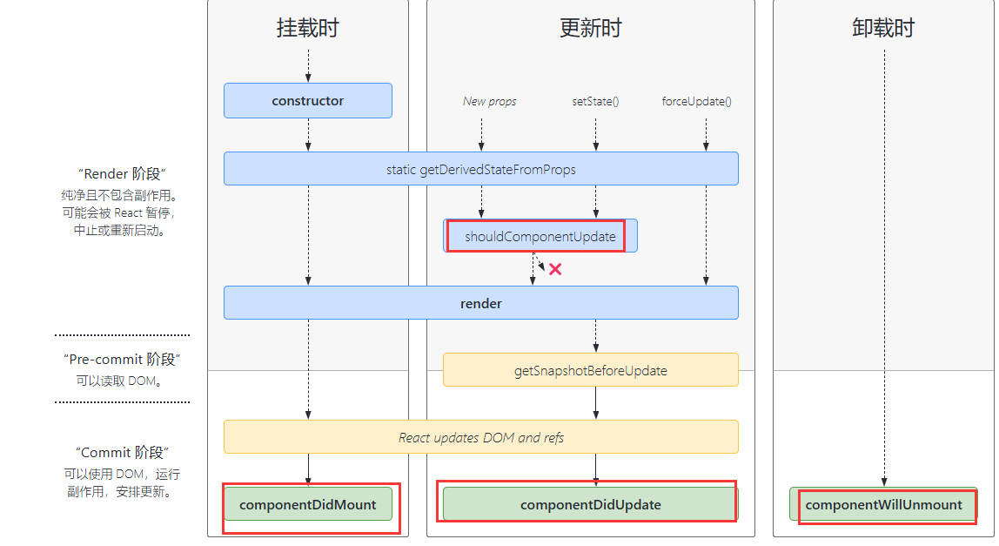

# React 基本使用之 class 组件

## JSX 使用

### 变量&表达式

定义：在 class 的`constructor`中定义变量

```js
class Demo extends React.Component {
  constructor(props) {
    super(props);
    this.state = {
      name: "joey",
      flag: true,
      imgUrl: "http://localhost:5173/frontend_blog/doraemon.png",
    };
  }
}
```

获取变量或表达式：使用`{}`包裹,通过`this.state.xxx`获取

```js
class Demo extends React.Component {
  render() {
    //变量
    const pElem = <p>{this.state.name}</p>;
    //表达式
    const exprElem = <p>{this.state.flag ? "yes" : "no"}</p>;
    const imgElem = ;
    const allElem = (
      <div>
        {pElem}
        {exprElem}
        {imgElem}
      </div>
    );
    return allElem;
  }
}
```

### class style

#### 样式类名

react 中，给某个元素设置 css 样式类名，使用`className`属性：`<div className="class1"/>`

#### style 样式

先定义一个变量，再把这个变量赋给 style 属性:

```jsx
const styleObj={
    fontSize:'100px'
}
<div style={styleObj}/>
<div style={{fontSize:'100px'}}/>
```

### 原生 html

使用`dangerouslySetInnerHTML`属性添加

```jsx
const rawHtml = "<h1>111</h1>";
const rawHtmlData = {
  __html: rawHtml,
};
const rawElem = (
  <div>
    <p dangerouslySetInnerHTML={rawDataHtml} />
  </div>
);
```

### 条件判断

1. if...else 语句
2. 三元表达式：`const a=condition?true:false`
3. 逻辑运算符：`&&`,`||`

### 列表渲染

1. map：用于遍历
2. key:不能是 index 索引

```jsx
this.state = {
  list: [
    {
      name: "joey",
      id: 1,
    },
    {
      name: "we",
      id: 2,
    },
  ],
};
render(){
    return this.state.list.map((item,index)=>(<p key={item.id}>{item.name}</p>))
}
```

## react 事件

### this 的处理

React 的事件使用`onXxxx`属性处理，在类组件中必须重新绑定 this

```jsx
class JsxBaseDemo extends React.Component {
  constructor(props) {
    super(props);
    this.state = {
      name: "doctor",
    };
    //去掉这句会报错
    this.handleClickUrl = this.handleClickUrl.bind(this);
  }
  handleClickUrl() {
    this.setState({
      name: "Rose",
    });
  }
  render() {
    return <p onClick={this.handleClickUrl}>{this.state.name}</p>;
  }
}
```

发现上述代码中如果注释掉对 this 的绑定,会出现如下报错

> Cannot read properties of undefined (reading 'setState')

原因是：this 默认指向**事件触发的对象**，而不是组件本身。因此，this 会丢失对组件实例的引用,而去掉注释以后该语句会将 this 绑定到组件本身

::: tip react 潜在性能优化点
this 绑定放在 render 里面会导致每次重新渲染时都创建一个新的函数实例，从而影响性能，可通过下面 2 个方法解决：

1. constructor 内只绑定一次
2. 使用箭头函数

:::

### event 参数

::: tip 事件冒泡
当一个事件被触发时，它会从最具体的元素（触发事件的元素）开始，逐层向上传播到更高层次的父元素,触发父元素的同类事件，直到到达 document 对象
:::
如果没有传任何参数给 react 事件，则 react 默认第一个参数为`event`参数,是 react 封装的，并不是原生的 Event,可以通过`event.__proto__.constructor`获取原生 Event

#### 常用属性和方法：

- 阻止默认行为：`event.preventDefault()`
- 阻止冒泡：`event.stopPropagation()`
- `event.target`:指向触发事件的元素,即事件最初发生的地方,事件冒泡过程中 target 不会改变
- `event.currentTarget`:指向正在执行事件处理函数的元素,值会随着事件从内层冒泡到外层元素而变化
- `event,nativeEvent`:获取原生 Event

::: warning 事件挂载

- React16 将事件处理程序是挂载在 document 上
- React17 将事件处理程序挂载在根元素上

:::

#### react 事件和 DOM 事件区别

1. 事件处理机制：DOM 事件是每个元素绑定自己的事件监听器,而 React 事件使用事件委托，事件处理程序挂载在根元素
2. 是否需要手动处理浏览器差异：DOM 事件需要，React 事件不需要
3. 是否是原生 Event 对象：DOM 事件为原生对象，React 事件不是
4. 事件绑定：DOM 事件通过监听器绑定，React 事件通过 JSX 绑定
5. 性能问题：DOM 事件直接绑定事件存在性能问题，React 通过事件委托机制，可以提高性能
6. 事件管理：DOM 事件需要手动增删，React 事件自动管理事件的生命周期
7. 事件冒泡和捕获：DOM 事件可以设置事件捕获或冒泡模式，React 事件默认冒泡模式，不能直接设置事件捕获

### 传递自定义参数

```jsx
const handleClickUrl = (id, title, event) => {};
<a
  href={item.id}
  onClick={(event) => this.handleClickUrl(item.id, item.title, event)}
  key={item.id}
>
  {item.title}
</a>;
```

## 表单

### 受控组件

定义：表单项的 value 由 React 组件的状态（state）控制的组件

要点：

1. React 状态 state 变量控制输入值
2. 输入变化通过 onChange 事件处理修改 state 值

使用：

```jsx
const handleInputChange = (event) => {
  this.setState({
    name: event.target.value,
  });
};
<input
  id="inputName"
  value={this.state.name}
  onChange={this.handleInputChange}
/>;
```

### 非受控组件

## 组件通信

### 父子组件

通过 props 传递数据和函数

### 兄弟组件

将共享的 state 变量提升到父组件中,再结合 props 传递数据和函数完成兄弟组件之间的通信

### 跨多级组件通信

context,redux,eventEmitter

## setState

### 不可变值

在更新状态时，React 期望用户返回一个全新的对象或数组（即不可变值），而不是修改现有的状态对象。

- 数组：push、pop、splice 这些会改变原数组的方法不能直接对 state 变量进行操作,可以使用其他方法或者展开运算符`...`
- 对象：必须用 Object.assign() 和展开运算符对 object 类型的 state 变量进行操作

### 同步 or 异步更新 & state 合并

#### React17

直接在 setState 外部访问 state 变量拿到的是原值；如果在 setState 的回调函数里访问，则可以拿到最新值，属于异步更新

```jsx
this.setState(
  {
    count: this.state.count++,
  },
  () => {
    console.log(this.state.count); //打印的是最新值
  }
);
console.log(this.state.count); //打印的是原值
```

setTimeout 里的 setState 和自定义的 DOM 事件(通过绑定事件监听器)的 setState 属于同步更新

```jsx
setTimeout(() => {
  this.setState({
    count: this.state.count++,
  });
  console.log(this.state.count); //打印的是最新值
}, 0);
document.body.addEventListener("click", () => {
  this.setState({
    count: this.state.count++,
  });
  console.log(this.state.count); //打印的是最新值
});
```

#### 总结

批处理：Auto Batching,即合并+异步更新

react17:只有 React 组件才进行批处理（合并+异步更新）

- React 组件事件：异步更新+合并 state
- 自定义 DOM 事件,setTimeout：同步更新+不合并 state

react18:所有事件都自动进行批处理

React 组件事件和自定义 DOM 事件,setTimeout 保持一致，即：
异步更新+合并 state

好处：所有事件保持一致，降低开发人员的心智负担

## 生命周期

### 单组件生命周期



### 父子组件生命周期

- 挂载阶段：
  > 组件实例被创建并插入 DOM 树的过程
  - 创建组件实例渲染：父组件->子组件
  - 渲染完成后副作用执行：子组件->父组件
- 更新阶段：
  > 组件的 props 或 state 变化，触发重新渲染的过程
  - 更新之前及重新渲染：父组件->子组件
  - 更新结束后副作用执行：子组件->父组件
- 卸载阶段：
  > 组件从 DOM 中移除的过程
  - 卸载之前：子组件->父组件
