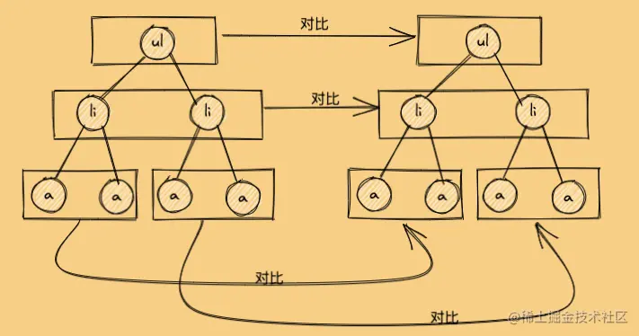
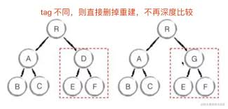

# react 底层原理

虚拟 DOM 是实现 Vue 和 React 的基础，diff 算法是虚拟 DOM 中最核心的部分。

## 虚拟 DOM

前提：DOM 操作非常耗费性能，而 js 执行速度快，Vue 和 React 是数据驱动视图，项目越复杂，DOM 操作越来越多，耗费性能

目标：有效控制 DOM 操作

解决方案：虚拟 DOM，用 JS 模拟 DOM 结构，计算出最小的变更范围后再更新 DOM，有效控制 DOM 操作

### diff 算法

diff(对比) 算法在 MVVM 框架日常使用中的体现：比如 key

时间复杂度：O(n^3)->O(n)

过程：

1. 遍历 tree1 和 tree2
2. 排序

> 问题：1000 个节点，要计算 1 亿次，算法不可用

时间复杂度 O(n):

1. 只比较同一层级，不跨级比较
   
2. tag 不相同，则直接删掉重建，不再深度比较
   
3. tag 和 key 都相同，则认为是相同节点，不再深度比较

### 用 JS 模拟 DOM 结构 VNode

vNode:虚拟节点，是一棵树

```js
const vNode = {
  tag: "div",
  props: {
    className: "container",
    id: "div1",
  },
  children: [
    {
      tag: "p",
      children: "vdom",
    },
    {
      tag: "ul",
      props: { style: "font-size:20px" },
      children: [
        {
          tag: "li",
          children: "a",
        },
      ],
    },
  ],
};
```

### h 函数

接受三个参数,返回 VNode 对象

1. 标签
2. 属性 props
3. children

::: code-group

```js [vNode]
//elem：vNode对应的DOM元素
function vNode(selector, data, children, text, elm) {
  let key = data === undefined ? undefined : data.key;
  return { selector, data, children, text, elm, key };
}
```

```ts [h函数]
function h(selector: string): VNode;
function h(selector: string, data: VNodeData | null): VNode;
function h(selector: string, children: VNodeChildren): VNode;
function h(
  selector: string,
  data: VNodeData | null,
  children: VNodeChildren | null
): VNode;
function h(selector, b?: any, c?: any): VNode {
  var data: VNodeData = {},
    children: any;text:any,i:number
 //具体实现
 //最终返回
 return vNode(selector,data,children,text,undefined)
}
```

:::

### patch 函数

语法：

- 初次渲染：`patch(container,vNode)`
- DOM 更新：`patch(vNode,newVNode)`
- 销毁 DOM:`patch(newVNode,null)`

```ts
function patch(oldVNode: VNode | Element, vNode: VNode) {
  if (!isVNode(oldVNode)) {
    //创建空的vnode，关联到这个dom元素
  }
  if (sameVNode(oldVNode, vNode)) {
    // 相同的vnode（key和selector都相同），进行对比
    //执行prepatch hook
    //设置vnode.element
    const elm = (vNode.elm = oldVNode.elm!);
    const oldChildren = oldVNode.children;
    const children = vNode.children;
    //判断新的vNode.text为undefined
    if (isUndef(vNode.text)) {
      if (isDef(oldChildren) && isDef(children)) {
        if (oldChildren !== children) {
          //新旧都有children
          updateChildren();
        }
      } else if (isDef(children)) {
        //新children有，旧children无(旧text有)
        //清空text添加children
      } else if (isDef(oldChildren)) {
        //旧children有，新children无
        //移除children
      } else if (isDef(oldVNode.text)) {
        //旧text有，设置text
      }
    } else if (oldVNode.text !== vNode.text) {
      //移除旧的children并设置新的text
    }
  } else {
    //不同的vnode,直接删除重建
  }
}
```

### updateChildren 函数

新旧两个 children 都使用双指针往中间遍历

```ts
function updateChildren(
  parentElem: Node,
  oldChildren: VNode[],
  children: VNode[],
  insertedVNodeQueue: VNodeQueue
) {
  let oldStartIdx = 0,
    oldEndIdx = oldChildren.length - 1,
    oldStartVNode = oldChildren[0],
    oldEndVNode = oldChildren[oldEndIdx],
    newStartIdx = 0,
    newEndIdx = Children.length - 1,
    newStartVNode = children[0],
    newEndVNode = children[newEndIdx];
  while (oldStartIdx <= oldEndIdx && newStartIdx <= newEndIdx) {
    if (oldStartVNode === null) {
    } else if (oldEndVNode === null) {
    } else if (newStartVNode === null) {
    } else if (newEndVNode === null) {
    } else if (sameVNode(oldStartVNode, newStartVNode)) {
      //开始和开始对比
      patchVNode(oldStartVNode, newStartVNode, insertedVNodeQueue);
      oldStartVNode = oldChildren[++oldStartIdx];
      newStartVNode = children[++newStartIdx];
    } else if (sameVNode(oldEndVNode, newEndVNode)) {
      //结束和结束对比
      patchVNode(oldEndVNode, newEndVNode, insertedVNodeQueue);
      oldEndVNode = oldChildren[--oldEndIdx];
      newEndVNode = children[--newEndIdx];
    } else if (sameVNode(oldStartVNode, newEndVNode)) {
      //旧children的开始和新children结束对比
      patchVNode(oldStartVNode, newEndVNode, insertedVNodeQueue);
      //插入
      //...
      oldStartVNode = oldChildren[++oldStartIdx];
      newEndVNode = children[--newEndIdx];
    } else if (sameVNode(oldEndVNode, newStartVNode)) {
      //旧children结束和新的children开始对比
      patchVNode(oldEndVNode, newStartVNode, insertedVNodeQueue);
      //插入
      //...
      oldEndVNode = oldChildren[--oldEndIdx];
      newStartVNode = children[++newStartIdx];
    } else {
      //以上四个都未命中
    }
  }
}
```

### 总结：

核心概念：

- h:创建虚拟 DOM 节点
- vnode:虚拟 DOM 节点,是对真实 DOM 的 JS 对象描述
- patch:对比新旧节点，然后高效更新 DOM
  1. 创建节点(vnode->DOM)
  2. 比较新旧 vnode(diff)
  3. 更新差异(只改动有变化的部分)
     > 如果新旧节点完全不一样，则直接销毁旧节点，创建新节点；递归对子节点执行 patch
- diff:核心比对算法,最小化 DOM 改动
  1. 同层级比较：不跨层对比节点，提升性能
  2. 同类型节点继续比对：不同类型直接替换
  3. 列表比对优化：key 提升性能
     > diff 不用“逐节点全量比较的原因：全量对比时间复杂度 O(n³)，React/Vue 用逐层对比把复杂度降到 O(n)。
- key：唯一标识节点
  > key 为什么不能用索引？ 👉 索引会随位置变化，导致节点错位更新，出现重渲染、状态错乱

## 函数式编程

不可变值：

- 数组：不能对数组类型的 state 变量进行 push/pop/splice 等操作
- 对象：不能直接对 Object 类型的 state 变量进行属性设置，比如 `this.state.obj.xx`

## JSX 本质

JSX 等同于 Vue 模板，

## React 合成事件机制

## setState 和 batchUpdate

## 组件渲染过程

## 前端路由

## 错误边界

解决问题：部分 UI 的 JavaScript 错误导致整个应用崩溃

本质：React 组件，可以捕获发生在其子组件树任何位置的 JavaScript 错误，并打印这些错误，同时展示降级 UI，并不会渲染那些发生崩溃的子组件树；且可以捕获发生在整个子组件树的渲染期间、生命周期方法以及构造函数中的错误。

无法捕获的场景：

- 事件处理
- 异步代码（例如 setTimeout 或 requestAnimationFrame 回调函数）
- 服务端渲染
- 它自身抛出来的错误（并非它的子组件）

定义方法：
class 组件中定义了`static getDerivedStateFromError()`或者`componentDidCatch()`这两个生命周期方法的一个，这个 class 组件就是一个错误边界

```jsx
class ErrorBoundary extends React.Component {
  constructor(props) {
    super(props);
    this.state = { hasError: false };
  }
  static getDerivedStateFromError(error) {
    // 更新 state 使下一次渲染能够显示降级后的 UI
    return { hasError: true };
  }
  componentDidCatch(error, errorInfo) {
    // 你同样可以将错误日志上报给服务器
    logErrorToMyService(error, errorInfo);
  }
  render() {
    if (this.state.hasError) {
      // 你可以自定义降级后的 UI 并渲染
      return <h1>Something went wrong.</h1>;
    }
    return this.props.children;
  }
}
//使用
<ErrorBoundary>
  <MyWidget />
</ErrorBoundary>;
```

该功能在函数组件中已经废弃，可通过以下方式实现：

1. 使用 ErrorBoundary 类组件 作为高阶组件
2. 采用第三方库，比如 react-error-boundary 的 useErrorBoundary
