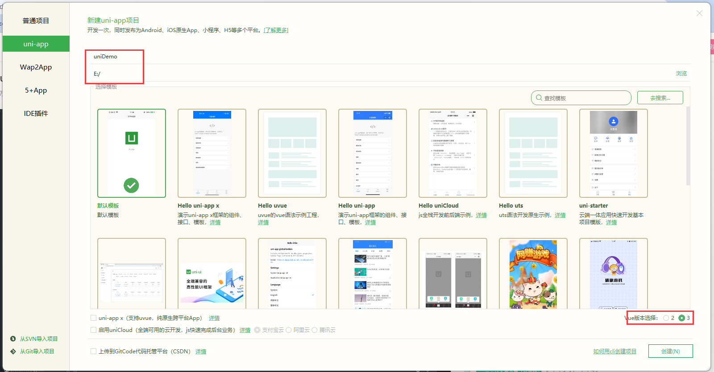
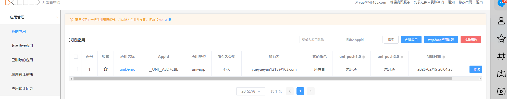
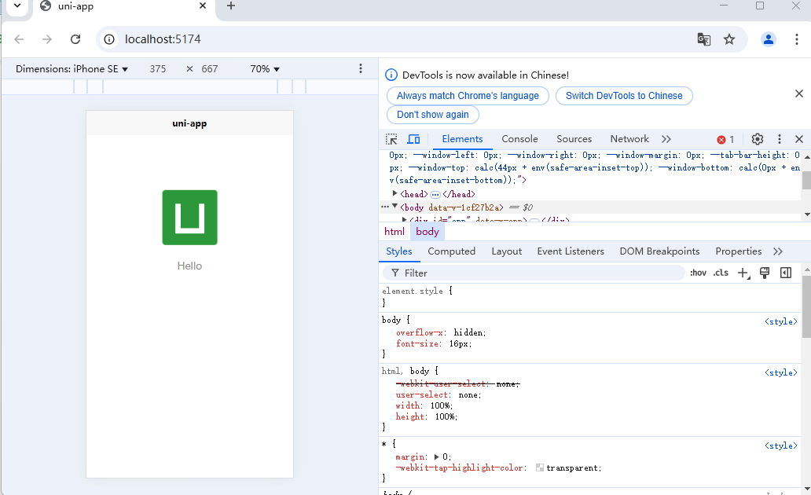
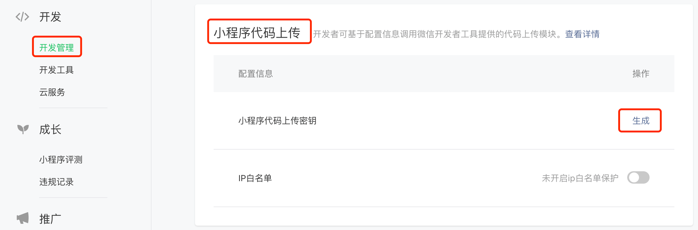

# uniapp 基础常识

## 优势

1. 跨平台：真正做到一套代码，多端发行。使用条件编译，可以在单个项目里调用不同平台的特色功能
2. 运行体验好：组件/api 和微信小程序一致，兼容 weex 原生渲染
3. 通用技术栈：vue 的语法，微信小程序的 api,内嵌 mpvue
4. 开放生态，组件更丰富：
   - 支持通过 npm 安装第三方包
   - 支持微信小程序自定义组件和 SDK
   - 兼容 mpvue 组件和项目
   - App 端支持和原生混合编码

## 创建新的 uniapp 项目

### 编辑器

1. 下载 HBuilder 并解压缩移动到安装的地方
2. 用文件夹下的`HBuilderX.exe`创建桌面快捷方式

### 创建新项目

1. 文件->新建->项目
2. 填写对应信息
   
3. [验证是否创建成功](https://dev.dcloud.net.cn/pages/app/list)
   
4. 运行在浏览器：运行->运行到浏览器->选中 chrome
   

#### 运行在微信开发者工具

- HBuild:运行->运行到小程序模拟器
- 小程序开发者工具：设置->安全设置->服务端口修改为启动状态

::: info 提示
本地 HBuilder 将 uniapp 打包成小程序代码，运行在微信开发者工具的 ide 上
:::

### 发布小程序

1. 申请微信小程序 AppID
2. HBuilder 菜单栏：发行->小程序-微信
3. 获取上传密钥：打开微信公众平台官网, 扫码登录，左侧菜单【开发 -> 开发管理】，点击 tab【开发设置】
4. 也可以在微信开发者工具中[手动上传](https://developers.weixin.qq.com/miniprogram/dev/framework/quickstart/release.html#%E5%8F%91%E5%B8%83%E4%B8%8A%E7%BA%BF)
   

## 项目目录结构

<pre>
<code>
┌─uniCloud              云空间目录
│─components            符合vue组件规范的uni-app组件目录
│  └─comp-a.vue         可复用的a组件
├─utssdk                存放uts文件（已废弃,uni-appx项目特有）
├─pages                 业务页面文件存放的目录
│  ├─index
│  │  └─index.vue       index页面
│  └─list
│     └─list.vue        list页面
├─static                存放项目的静态资源
├─uni_modules           存放uni_module 依赖
├─platforms             存放各平台专用页面的目录
├─nativeplugins         App原生语言插件 
├─nativeResources       App端原生资源目录
│  ├─android            Android原生资源目录 
|  └─ios                iOS原生资源目录 
├─hybrid                App端存放本地html文件的目录
├─wxcomponents          存放微信小程序、QQ小程序组件的目录
├─mycomponents          存放支付宝小程序组件的目录
├─swancomponents        存放百度小程序组件的目录
├─ttcomponents          存放抖音小程序、飞书小程序组件的目录
├─kscomponents          存放快手小程序组件的目录
├─jdcomponents          存放京东小程序组件的目录
├─unpackage             非工程代码，一般存放运行或发行的编译结果
├─main.js               Vue初始化入口文件
├─App.vue               应用配置，用来配置App全局样式以及监听 
├─pages.json            配置页面路由、导航条、选项卡等页面类信息
</code>
</pre>
