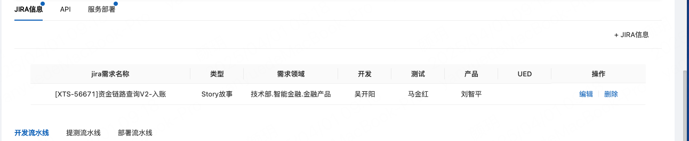
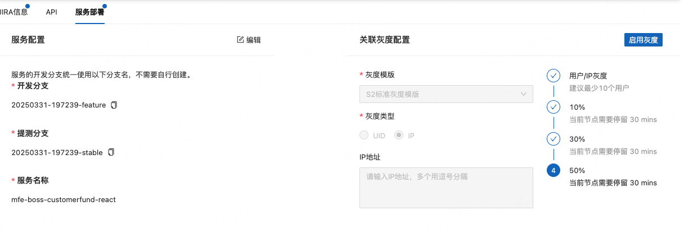

# captain平台发布

前端日常使用的平台地址：https://sitcaptain.xtrfr.cn/captain/plan/index

正式环境平台地址：https://captain.xtadmins.com/captain/workbench/index

文档地址：https://alidocs.dingtalk.com/i/nodes/Gl6Pm2Db8D3xp52rCmn1joNRJxLq0Ee4?corpId=

平台作用：进行预发布以及生产发布环节使用的平台，回归验证依旧是走job发布的途径

## 创建jira任务
创建jira任务，去sitcaptain平台新建发布单，并将captain对应的任务单地址填写到jira
## 平台内新建并填写预发布申请单
菜单选择 `发布计划-测试计划列表`,点击`新建发布`按钮

表单填写：
- 计划名称：一般是jira任务名称
- 需求领域：先看看jira和父任务
    - mfe-boss-financial-network:技术部.业务平台.金融平台.闪接平台
    - mfe-boss-customerfund(-react):技术部.业务平台.金融平台.资金平台
- 站点区域：国内-上海
- 生产服务发布策略：全量发布
- 计划上线时间：一般设置为2周

::: warning
计划时间冲突的话，参考[文档](https://alidocs.dingtalk.com/i/nodes/ydxXB52LJq73AObxiELzRb1qWqjMp697?utm_scene=team_space)处理
:::

## 补充其他信息

1. 点进测试计划详情，在jira信息上添加对应的jira任务链接

在新建jira的时候可以点击右侧云朵图标可以自动填充除了需求领域以外的信息
2. 点进服务部署tab查看信息

captain平台会自动生成开发分支以及提测分支并同步到gitlab;后面只需要从gitlab拉取该分支进行开发即可

::: warning
启用灰度的时候必须把产品的uid加入表单中
:::

3. 如果涉及到新增页面，需要添加boss权限
- 权限名称：
- 权限url:
- 权限类型：页面/接口/数据权限
- 状态：
- 互斥权限：
- 角色管理：

## 提测流程
环境：预发布环境->灰度测试->生产环境

## 问题解决方案
### 创建发布所属领域字段选错
建议重新创建
## 疑问
1. 灰度测试必须满24小时？
2. 需求领域怎么选择，前后端是否需要保持一致
3. 一些不可编辑部分的表单内容如果填写错误怎么处理
