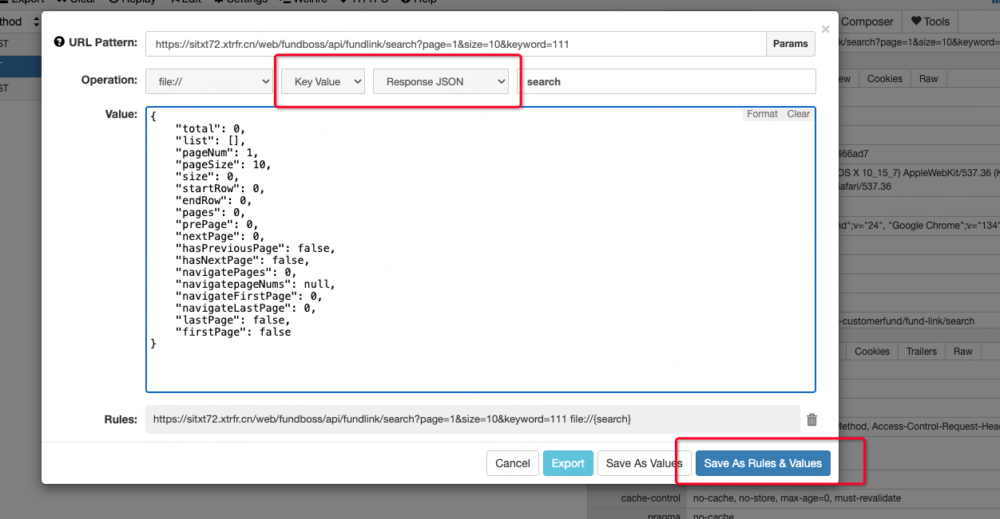
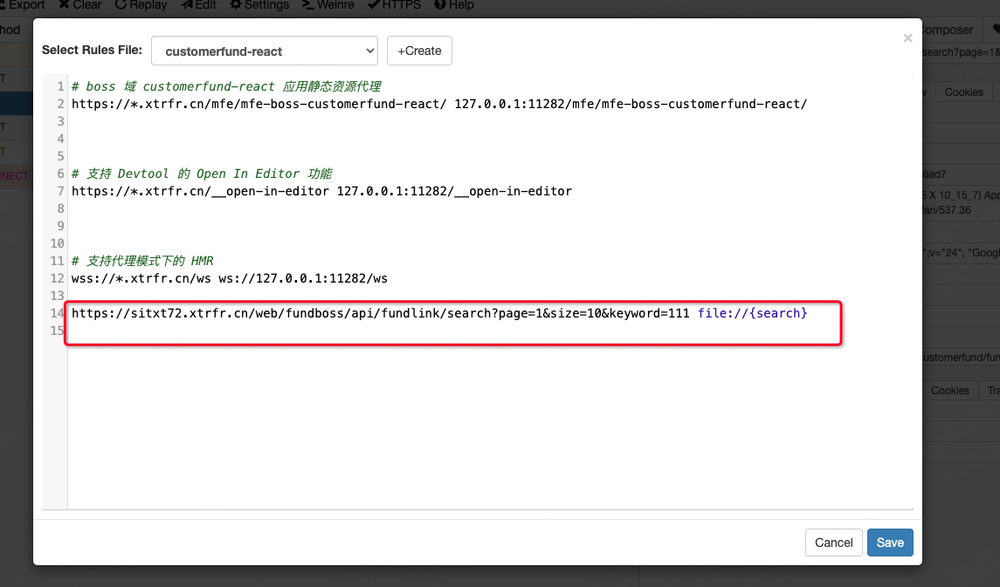

# 前端开发数据mock

## 背景：
后端需要修改接口，导致测试环境暂时没有数据，但是前端开发需要数据，所以需要前端自行mock数据

## 解决方法：

使用whistle工具实现接口mock

## 具体步骤：

### 定位接口
在页面调用需要mock数据的接口，右键点击出现菜单，选中`Mock`选项
### 修改返回结构

修改operation的结构并点击保存按钮

### 选择规则文件
选中需要生效的规则文件，比如选择`customerfund-react`文件，点击保存后即可在这个文件下自动生成对应的代理规则

### 修改mock值
点击`values`选项，可以修改对应接口的返回值